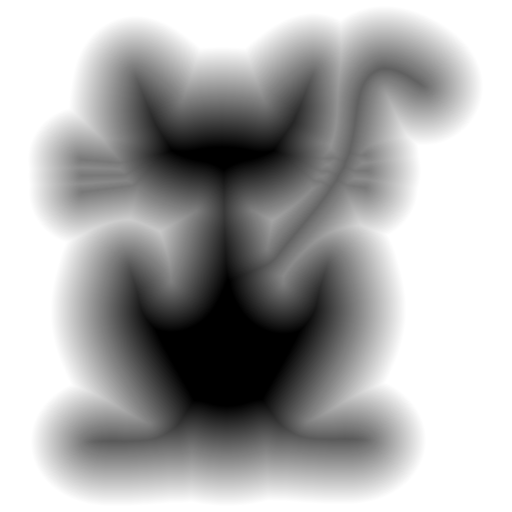

# Convert mask textures to SDF textures | マスクテクスチャのSDF化

※日本語は (下の方に)[#japanese] あります

Welcome! `tex2sdf` is a tool to make SDF textures out of solid shape textures.
The license is MIT, so feel free to use it!

Download a working version from the builds page.

This repository contains the following:
* **tex2sdf.h**
    * This is an [stb-style](https://github.com/nothings/stb) single-header C library that contains all the actual pixel logic.
    * There are no dependencies, just drop it in and go.
* **tex2sdf.exe** (`frontend/console/main.c`)
    * This is a console program that uses the `tex2sdf.h` library to load a texture, convert it, and save it out.
    * All functionality of the library is exposed, as command arguments
* **tex2sdf_gui.exe** (`frontend/gui/main.c`)
    * Coming Soon™
    * This will eventually be a graphical application, currently it is WIP (in the `uidev` branch).

The main code is mostly a port of Chris Cummings' wonderful C# Unity tool [SignedDistanceFields](github.com/chriscummings100/signeddistancefields).
I wanted a way to use it outside of Unity, so here it is.
Check out his [article series about SDFs](https://shaderfun.com/2018/03/23/signed-distance-fields-part-1-unsigned-distance-fields/), you won't regret it!

## Examples

## FAQ

### What is the license?

This is MIT-licensed, since it is a port of C# code written by someone else.
The original repository is at [chriscummings100/signeddistancefields](github.com/chriscummings100/signeddistancefields).

Please note that the original repository does not have a license.
I was given permission to license this under MIT by an explicit comment, in [this blog article's comments section](https://shaderfun.com/2018/07/23/signed-distance-fields-part-8-gradients-bevels-and-noise/).
**If this is too uncertain for you license-wise, please refrain from using this repository.**
I claim no responsibility in the event the original author retracts his statement.

### What is SDF?

An SDF (Signed-Distance-Field) is a field with a signed distance.
That is a circular description isn't it!
Essentially it is a field where each point describes how far away from an implicit shape it is situated.
The distance can be either positive or negative.

See Inigo Quilez's page on [2D SDF Functions](https://iquilezles.org/articles/distfunctions2d/) for more info.
For how this relates to textures, consider [Chris Cummings' excellent article series](https://shaderfun.com/2018/07/23/signed-distance-fields-part-8-gradients-bevels-and-noise/).

### Why C? Why header-only?

After searching for the best SDF conversion code, I found it, but it was in Unity C#.
Since I needed this for a non-Unity project, it was necessary to have something outside of Unity.

I chose C for maximum portability, to make sure that I and anyone who needed it could for sure use it from anywhere.
The reason behind making it an [stb-style](https://github.com/nothings/stb) "single-header" library is to remove as much friction as possible and allow just dropping it in.

Since this is mostly just a port, a lot of the code remains mostly the same, besides naming conventions.
There are likely performance or structural improvements that can be made, but it is satisfactory at the moment for my purposes.

### Supported Platforms

The console frontend supports the following:
* Windows
* Linux

The `tex2sdf.h` header is fully-portable C99, also compilable as C++.
It should run on any 64-bit platform. 32-bit has not been tested.

### How to compile?

#### Header

If you're just using the `tex2sdf.h` header, you just need to drop it in your project.
In one of your .c files, define `TEX2SDF_IMPLEMENTATION` before the include.
For more information, read the comments at the beginning of the file.

#### Frontends

If you want to compile the GUI (WIP) or console frontends, run the `build.bat` (for Windows) or `build.sh` (for Linux).
The binaries will be under the `build/` folder.

For Windows, you will need to run `bulid.bat` from a Visual Studio console.

### What is the algorithm behind the converter?

This uses an Eikonal sweep algorithm, for the smoothest result.
To learn more about it, check out [the original article on ShaderFun](https://shaderfun.com/2018/07/23/signed-distance-fields-part-8-gradients-bevels-and-noise/).

(This project is mostly a port of C# code from the article, I have yet to dig deep at how the alogrithm works)

# Japanese

ようこそ! `tex2sdf` はテクスチャに書き込まれたシェイプからSDFテクスチャを作るツールです。
ライセンスはMITなので、ご自由にどうぞ！

ビルドページから最新版をダウンロードしてみてください。

このリポジトリには以下が入っています：
* **tex2sdf.h**
    * これはいわゆる [stb風シングルヘッダーC言語ライブラリー](https://github.com/nothings/stb) で実際のピクセル処理が入ってます
    * 依存ライブラリは無いので、そのままコピペして使えます
* **tex2sdf.exe** (`frontend/console/main.c`)
    * これは上記の `tex2sdf.h` ライブラリを使用して、テクスチャを書き込み、変換し、保存する、という基本的な操作ができるコンソールプログラムです。
    * ライブラリの全機能がコマンド引数として使用可能
* **tex2sdf_gui.exe** (`frontend/gui/main.c`)
    * Coming Soon™
    * これはいつかGUIアプリとなりますが、現在開発中（`uidev` ブランチにて）

メインのコードは基本的にChris Cummings氏の素晴らしいUnity C#ツール [SignedDistanceFields](github.com/chriscummings100/signeddistancefields)　の移植です。
もともとUnity外で使える物がほしかったので、作ってみました。
詳しくは同氏の [SDFに関する記事（英語）](https://shaderfun.com/2018/03/23/signed-distance-fields-part-1-unsigned-distance-fields/) をご覧ください！めっちゃ面白いぜ〜

## サンプル

## FAQ

### ライセンスは?

ライセンスはMITで、もともと他人が書いたC#コードの移植です。
元のリポジトリはこちら：[chriscummings100/signeddistancefields](github.com/chriscummings100/signeddistancefields).

※元のリポジトリには厳密に言うとライセンスファイルは存在しません
しかし[こちらの記事のコメント欄](https://shaderfun.com/2018/07/23/signed-distance-fields-part-8-gradients-bevels-and-noise/)で直接MITで使っていいんですよと本人から伺いました。
**ライセンス的に不安な場合は、ご使用をお控えください。**
元々の開発者が許可を取り消した場合などは一切責任を負いません。ご理解のほどよろしくお願いいたします。

### SDFってなぁ〜に？?

SDF（Signed Distance Field | 符号付き距離フィールド）とは符号のついた距離を表すフィールドです。
説明が循環してますが！
要は、各ピクセルが暗黙形状からの距離を表すテクスチャです。
距離は正数もしくは負数。

もっと詳しくはInigo Quilez氏の素晴らしい記事 [2D SDF Functions（英語）](https://iquilezles.org/articles/distfunctions2d/) をご覧ください。
これがどうテクスチャと関連しているかに関しては、[Chris Cummings氏のわかりやすい記事シリーズ（英語）を読んでみてください](https://shaderfun.com/2018/07/23/signed-distance-fields-part-8-gradients-bevels-and-noise/)。

### なぜC言語？なぜヘッダーオンリー？

一番品質の高いSDF変換コードを探したら、見つけたけどUnity専用C#でした。
非Unityプロジェクトで使いたかったので、どこでも使える物がほしかったのです。

移植性の高さを望み、誰でもどこでも使えるように、C言語を選びました。
そして [stb風シングルヘッダーライブラリ](https://github.com/nothings/stb)にした理由は、使用までの手数を減らしそのままポンッとコピペできるようにするためです。

これはほとんど移植のため、命名規則など以外は、ほとんどのコードはそのままです。
処理負荷や構造的な改善の余地はあるに違いないですが、自分の目的の範囲内はこのままで使えています。

### 対応プラットフォーム

コマンドライン用のフロントエンドは以下を対応しています：
* Windows
* Linux

`tex2sdf.h` ライブラリ自体はポータブルなC99で、C++としてもコンパイル可能です。
基本どの64-bitプラットフォームで使用できるはずです。32-bitは未確認。

### どうやってコンパイルする?

#### ヘッダー

もし `tex2sdf.h` ヘッダーを使っているだけなら、プロジェクトにコピペするだけで使用できます。
一つの.c （もしくは.cpp）ファイルに、インクルードする行の前に`#define TEX2SDF_IMPLEMENTATION`を足します。
詳しくは、ファイルの上のコメントをご覧ください。

#### フロントエンド

もしGUI（開発中）またはCLIのフロントエンドをコンパイルしたい場合は、`build.bat`（Windowsの場合）または `build.sh` （Linuxの場合）を実行します。
バイナリは `build/` フォルダーに作成されます。

Windowsの場合は、`build.bat` をVisual Studioのコンソールで実行する必要があります。

### 変換アルゴリズムは？

一番スムーズな結果を得るために、基本的にEikonal sweepというアルゴリズムを使っています。
詳しくは、[元々の記事（英語）をShaderFunで](https://shaderfun.com/2018/07/23/signed-distance-fields-part-8-gradients-bevels-and-noise/)　ご覧ください。

（このプロジェクトはほとんどその記事のC#コードの移植にすぎないため、アルゴリズムの詳しい動作はまだ調べていないです）
