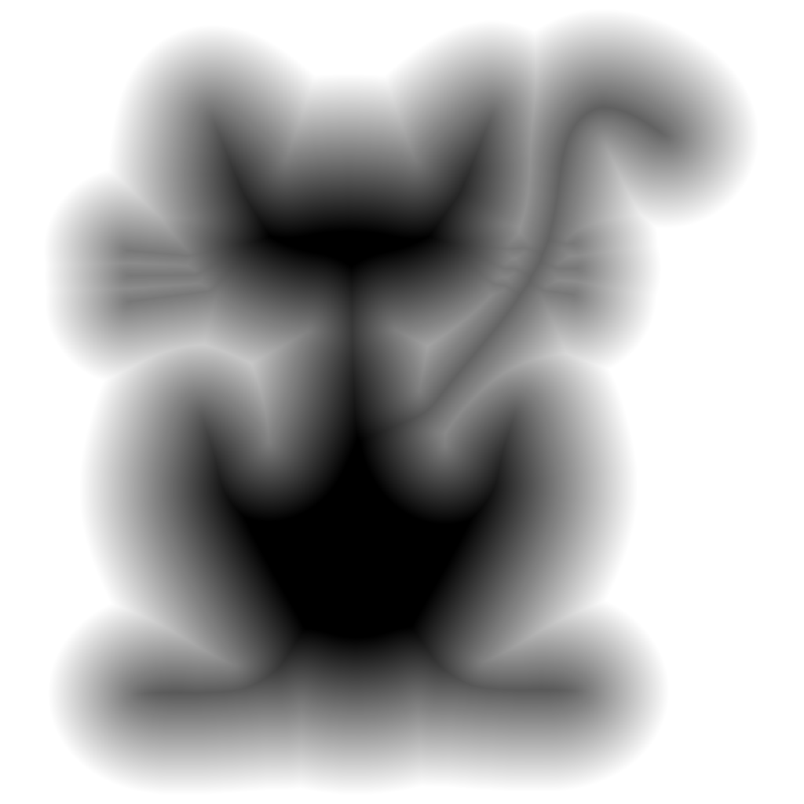

# Convert mask textures to SDF textures

Welcome! `tex2sdf` is a tool to make SDF textures out of solid shape textures.
The license is MIT, so feel free to use it!

Download a working version from the builds page.

This repository contains the following:
* **tex2sdf.h**
    * This is an [stb-style](https://github.com/nothings/stb) single-header C library that contains all the actual pixel logic.
    * There are no dependencies, just drop it in and go.
* **tex2sdf.exe** (`frontend/console/main.c`)
    * This is a console program that uses the `tex2sdf.h` library to load a texture, convert it, and save it out.
    * All functionality of the library is exposed, as command arguments
* **tex2sdf_gui.exe** (`frontend/gui/main.c`)
    * Coming Soon™
    * This will eventually be a graphical application, currently it is WIP (in the `uidev` branch).

The main code is mostly a port of Chris Cummings' wonderful C# Unity tool [SignedDistanceFields](github.com/chriscummings100/signeddistancefields).
I wanted a way to use it outside of Unity, so here it is.
Check out his [article series about SDFs](https://shaderfun.com/2018/03/23/signed-distance-fields-part-1-unsigned-distance-fields/), you won't regret it!

## Examples

## FAQ

### What is the license?

This is MIT-licensed, since it is a port of C# code written by someone else.
The original repository is at [chriscummings100/signeddistancefields](github.com/chriscummings100/signeddistancefields).

Please note that the original repository does not have a license.
I was given permission to license this under MIT by an explicit comment, in [this blog article's comments section](https://shaderfun.com/2018/07/23/signed-distance-fields-part-8-gradients-bevels-and-noise/).
**If this is too uncertain for you license-wise, please refrain from using this repository.**
I claim no responsibility in the event the original author retracts his statement.

### What is SDF?

An SDF (Signed-Distance-Field) is a field with a signed distance.
That is a circular description isn't it!
Essentially it is a field where each point describes how far away from an implicit shape it is situated.
The distance can be either positive or negative.

See Inigo Quilez's page on [2D SDF Functions](https://iquilezles.org/articles/distfunctions2d/) for more info.
For how this relates to textures, consider [Chirs Cummings' excellent article series](https://shaderfun.com/2018/07/23/signed-distance-fields-part-8-gradients-bevels-and-noise/).

### Why C? Why header-only?

After searching for the best SDF conversion code, I found it, but it was in Unity C#.
Since I needed this for a non-Unity project, it was necessary to have something outside of Unity.

I chose C for maximum portability, to make sure that I and anyone who needed it could for sure use it from anywhere.
The reason behind making it an [stb-style](https://github.com/nothings/stb) "single-header" library is to remove as much friction as possible and allow just dropping it in.

Since this is mostly just a port, a lot of the code remains mostly the same, besides naming conventions.
There are likely performance or structural improvements that can be made, but it is satisfactory at the moment for my purposes.

### Supported Platforms

The console frontend supports the following:
* Windows
* Linux

The `tex2sdf.h` header is fully-portable C99.
It should run on any 64-bit platform. 32-bit has not been tested.

### How to compile?

#### Header

If you're just using the `tex2sdf.h` header, you just need to drop it in your project.
In one of your .c files, define `TEX2SDF_IMPLEMENTATION` before the include.
For more information, read the comments at the beginning of the file.

#### Frontends

If you want to compile the GUI (WIP) or console frontends, run the `build.bat` (for Windows) or `build.sh` (for Linux).
The binaries will be under the `build/` folder.

For Windows, you will need to run `bulid.bat` from a Visual Studio console.

### What is the algorithm behind the converter?

This uses an Eikonal sweep algorithm, for the smoothest result.
To learn more about it, check out [the original article on ShaderFun](https://shaderfun.com/2018/07/23/signed-distance-fields-part-8-gradients-bevels-and-noise/).

(This project is mostly a port of C# code from the article, I have yet to dig deep at how the alogrithm works)
